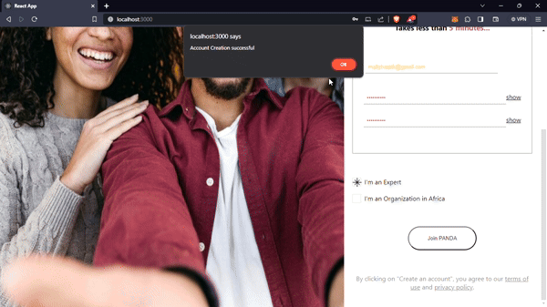
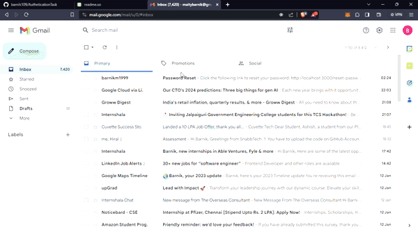

# Panda Authentication Task

A backend assingnment task
## Preview





## Run Locally

Clone the project

```bash
  git clone https://github.com/barnik109/AutheticationTask.git
```

Go to the project directory

```bash
  cd AutheticationTask
```

Install dependencies

```bash
  npm install
```

Start the server [Frontend]

```bash
  npm start
```
One new terminal to start backend sever
```bash
  cd AutheticationTask/Backend
```
```bash
  node server.js
```

### Important (For .env file located in Backend folder)

```bash
USER='<YOUR_EMAIL_ADDRESS>' //Sender's Email Address
PASS='<PASSWORD>'  
MONGODB_URI="mongodb+srv://<USER_NAME>:<PASSWORD@cluster0.5jym1l3.mongodb.net/?retryWrites=true&w=majority" 
//Your Mongodb Connection URL
```
[Watch this to get password](https://youtu.be/tR3ZlwDBjD0?si=m_oO8UgznzodBcj9)

### Tech Stack

**Client:** React

**Server:** Node, Express, Nodemailer, Bcrypt

### API Endpoints

**'/api/register'** - To register a new user
- This endpoint allows users to register by providing their email, password, and account type.
**'/api/signin'** - Sign-in user
- This endpoint verifies user credentials (email and password) and grants access upon successful authentication.

**'/api/forgot-password'** - Request password reset
- Users can request a password reset by providing their email, triggering an email with a reset link.

**'/api/reset-password'** - Reset user password
- This endpoint resets a user's password based on a provided token, typically accessed through a password reset link.

**'/api/resend-link'** - Resend password reset link
- Users can request a resend of the password reset link by providing their email, triggering a new reset link.

**'/api/user-info'** - Retrieve user information
- This endpoint retrieves basic user information, excluding sensitive data, for use in the application.
